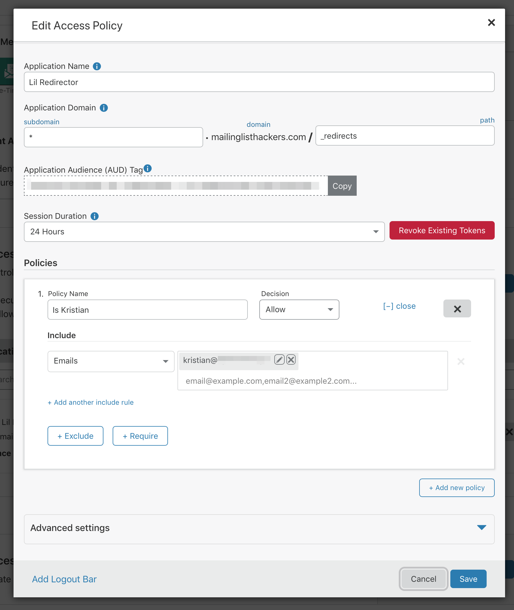

# lil redirector

a simple redirector engine for cloudflare workers


## installation

1. install the package

```bash
$ npm install lilredirector
```

2. create a kv namespace called `REDIRECTS` using wrangler

```bash
$ wrangler kv:namespace create REDIRECTS
```

3. add the `kv-namespace` provided by wrangler output to `wrangler.toml`

```toml
kv_namespaces = [{ binding = "REDIRECTS", id = "$id", preview_id = "$id" }]
```

## configure

```javascript
import redirector from 'lilredirector'

addEventListener('fetch', event => event.respondWith(handler(event)))

// note the `event` function argument! many workers scripts will
// pass in `event.request`, lilredirector needs the full `event` object
async function handler(event) {
  const { response, error } = await redirector(event)
  if (response) return response

  // optionally return an error response
  if (error) return error

  // other workers code
}
```

## how it works

#### handlers

lilredirector embeds itself under the `/_redirects` path. here's a list of the paths you'll be adding to your application:

| path                 | fn                             |
| -------------------- | ------------------------------ |
| `/_redirects`        | ui                             |
| `/_redirects/delete` | redirect delete handler        |
| `/_redirects/update` | redirect create/update handler |

#### editor

manage and create new redirects at `/_redirects`!

## authentication

you should put this behind authentication. the supported way to do this right now is with [cloudflare access](https://teams.cloudflare.com/access/). see the below screenshot for an example config:


